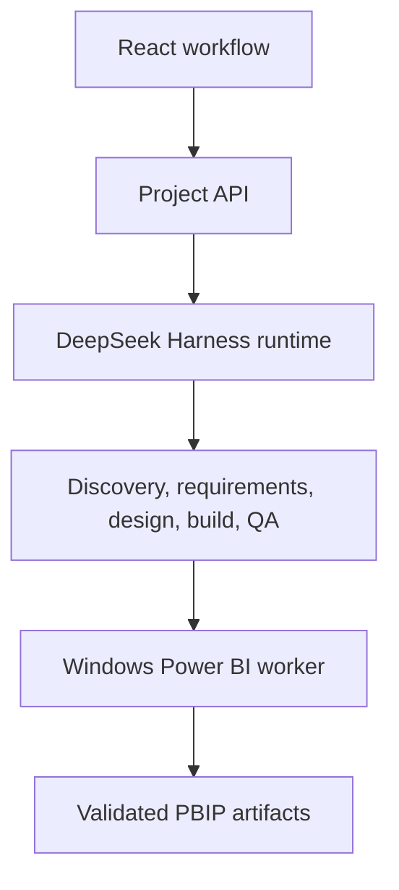

# Architecture and Harness migration

## Current state

The application has three active stages:

1. Source extraction and source-grounded knowledge analysis.
2. Automatic Power BI requirements analysis.
3. pen.dev layout generation and refinement through Codex and Pencil MCP.

The downloadable result is an agent build package. A separate agent still has to create the semantic model, measures, PBIR visuals, and final PBIP project.

## Target state

### Application-owned responsibilities

- File upload and artifact storage
- Source extraction and tabular profiling
- Requirements and report contracts
- Deterministic field, layout, and schema validation
- React workflow and approval presentation
- Project access control and retention

### Harness-owned responsibilities

- Durable agent sessions and resumable turns
- Model-provider selection
- Tool, skill, MCP, and subagent registration
- Long-running jobs and workflow coordination
- Approval events and audit history
- Specialized agent presets

### Windows worker responsibilities

- Power BI Desktop integration when required
- Power BI modeling MCP
- PBIP/PBIR/TMDL authoring
- DAX and semantic-model validation
- Opening and smoke-testing generated projects

## Migration strategy

The `AI_RUNTIME_MODE` setting provides an incremental seam:

- `direct`: existing direct DeepSeek JSON calls
- `harness`: the same prompts execute through the Harness sidecar

The application defaults to `direct` until the sidecar is installed and explicitly selected. This keeps the current workflow stable while Harness remains in developer preview.

### Phase 1 — runtime boundary

- Add a version-pinned Harness sidecar.
- Route structured DeepSeek work through it behind a feature flag.
- Preserve current schemas and deterministic validators.

### Phase 2 — durable project sessions

- Assign a stable project ID at upload.
- Reuse one Harness session per project and agent role.
- Project session events into the existing progress UI.
- Store artifact references rather than base64 files in prompts.

### Phase 3 — design agent

- Move Pencil MCP registration into a Harness design profile.
- Restrict writes to the generated `.pen` artifact.
- Preserve screenshot and geometry validation as required exit checks.

### Phase 4 — Power BI build agent

- Register PBIP, Power BI modeling, TMDL, PBIR, Power Query, and DAX tools.
- Execute `SKILL.md` as the build workflow.
- Dispatch Windows-dependent operations to a controlled worker.

### Phase 5 — QA gate

- Validate field and measure bindings.
- Validate relationships, formats, interactions, and accessibility.
- Validate layout against the approved `.pen` contract.
- Block download when critical checks fail.

## Security boundaries

- Uploaded files are evidence, never executable instructions.
- The analyst Harness profile has no shell or filesystem tools.
- The sidecar binds to loopback by default.
- API keys remain server-side.
- Power BI build tools operate in a project-specific workspace.
- Hosted deployment must add authentication, rate limits, artifact quotas, and durable object storage before accepting untrusted users.
